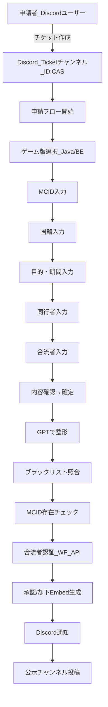
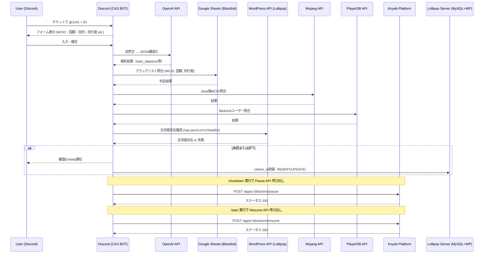

# Comzer-Administration-System
コムザール行政システム（Comzer Administration System）  
**Discord 自動入国審査 BOT + ブラックリスト管理 + 役職発言 + 国民データ連携**

---

## 目次

- [概要](#概要)
- [審査フロー](#審査フロー)
- [システムフロー](#システムフロー)
- [ファイル構成](#ファイル構成)
- [主要依存パッケージ](#主要依存パッケージ)
- [セットアップ](#セットアップ)
- [環境変数](#環境変数)
- [スラッシュコマンド一覧](#スラッシュコマンド一覧)
- [申請〜審査プロセス詳細](#申請審査プロセス詳細)
- [技術概要](#技術概要)
- [役職発言モード（rolepost）](#役職発言モードrolepost)
- [国民データ同期（czr-bridge）](#国民データ同期czr-bridge)
- [DM 通知 API](#dm-通知-api)
- [ログシステム](#ログシステム)
- [Googleスプレッドシート設定](#googleスプレッドシート設定)
- [よくあるトラブル](#よくあるトラブル)
- [ライセンス](#ライセンス)

---

## 概要

このリポジトリは、コムザール連邦共和国（Minecraft 仮想国家）の行政業務を **Discord 上で自動化** するための BOT を管理・開発するものです。

主な機能は以下の通りです。

- **自動入国審査**：申請内容を GPT-4o で構造化し、ブラックリスト・MCID 存在確認・入国期間チェックまで全自動処理
- **役職発言モード**：閣僚・外交官・審査官が Webhook を通じて役職名義で発言
- **ブラックリスト管理**：Google スプレッドシート連携で国・プレイヤーを管理
- **国民データ同期**：Discord メンバーの情報を WordPress API へ自動同期
- **DM 通知 API**：外部サービスからの審査結果通知を Discord DM で届ける REST API

---

## 審査フロー



---

## システムフロー



---

## ファイル構成

```
.
├── index.js                        # エントリーポイント。Discord クライアント初期化・Express サーバー起動
├── prompts.js                      # GPT-4o 向けプロンプトテンプレート（申請内容の JSON 変換指示）
├── package.json
├── config/
│   ├── config.json                 # チャンネル ID・クライアント ID 等の静的設定
│   └── roleConfig.js               # 役職ロール設定（Embed 名・アイコン・Webhook 名）
├── commands/
│   ├── embedPost.js                # /rolepost コマンド・役職発言モード管理
│   ├── deleteRolepost.js           # /delete_rolepost コマンド
│   ├── info.js                     # /info コマンド（国民登録情報表示）
│   ├── status.js                   # /status コマンド（接続診断）
│   ├── debug.js                    # /debug コマンド（デバッグモード切替）
│   ├── shutdown.js                 # /shutdown コマンド（Koyeb pause）
│   ├── start.js                    # /start コマンド（Koyeb resume）
│   ├── deploy.js                   # /deploy コマンド（コマンド再登録）
│   ├── deploy-commands.js          # コマンド登録スクリプト（npm run deploy で実行）
│   └── blacklist/
│       ├── index.js                # ブラックリストコマンドの集約・ルーティング
│       ├── addCountry.js           # /add_country
│       ├── removeCountry.js        # /remove_country
│       ├── addPlayer.js            # /add_player
│       ├── removePlayer.js         # /remove_player
│       ├── listBlacklist.js        # /list_blacklist
│       └── utils.js                # 権限チェック共通処理
├── handlers/
│   ├── eventhandlers.js            # ready / messageCreate / guildMemberAdd 等のイベント登録
│   ├── interactionHandler.js       # ボタン・モーダル・セレクトメニュー・コマンド分岐処理
│   └── messageHandler.js          # メッセージ受信・入国審査セッション開始
├── services/
│   ├── inspectionService.js        # 入国審査コアロジック（GPT → ブラックリスト → MCID → 合流者）
│   ├── sessionManager.js           # 審査セッション管理・タイムアウト監視
│   ├── webhookmanager.js           # 役職発言用 Webhook の取得・キャッシュ
│   └── notificationqueue.js        # DM 通知キュー・POST /api/notify エンドポイント
├── citizen_data/
│   ├── czrApi.js                   # czr-bridge API クライアント（HMAC 署名付き）
│   └── syncMembers.js              # Discord メンバー → WordPress への同期処理
├── utils/
│   ├── blacklistManager.js         # Google スプレッドシートとの CRUD 操作
│   ├── helpers.js                  # nowJST() など共通ユーティリティ
│   └── logger/
│       ├── index.js                # ロガー初期化・エクスポート
│       ├── hooks.js                # console.log / error のフック
│       ├── filters.js              # ログフィルタリング（機密情報の除外など）
│       ├── messageLog.js           # メッセージログ・デバッグログ出力
│       └── webhook.js              # Discord Webhook へのログ送信
├── lib/
│   └── sleep.js                    # sleep ユーティリティ
└── scripts/
    └── test-upsert.js              # czr-bridge の upsert 動作確認スクリプト
```

---

## 主要依存パッケージ

| パッケージ | 用途 |
|---|---|
| `discord.js` v14 | Discord API クライアント・スラッシュコマンド・Webhook 管理 |
| `openai` | GPT-4o による申請内容の自然言語解析・JSON 変換 |
| `axios` | Mojang API / PlayerDB API / Koyeb API / WordPress API への HTTP リクエスト |
| `google-spreadsheet` | Google スプレッドシートのブラックリスト読み書き |
| `google-auth-library` | Google サービスアカウント認証（JWT） |
| `express` v5 | `/api/notify` 等の REST API エンドポイント提供 |
| `body-parser` | POST リクエストの JSON パース |
| `node-fetch` | czr-bridge API へのリクエスト（ESM 環境） |

バージョン詳細は `package.json` を参照してください。

---

## セットアップ

### 1. リポジトリのクローン

```bash
git clone <repository-url>
cd <repository>
```

### 2. 依存関係のインストール

```bash
npm install
```

### 3. 環境変数の設定

`.env.example` を参考に `.env` を作成し、各種キーを設定してください。

```bash
cp .env.example .env
# エディタで .env を編集
```

### 4. スラッシュコマンドの登録

```bash
npm run deploy
```

グローバルコマンドとして Discord に登録されます。反映まで最大 1 時間かかる場合があります。

### 5. BOT の起動

```bash
npm start
```

`npm start` の `prestart` フックで自動的にコマンド登録も行われます。

> **Note:** Node.js 20 以上が必要です。

---

## 環境変数

| 変数名 | 説明 | 必須 |
|---|---|---|
| `DISCORD_TOKEN` | Discord Bot トークン | ✅ |
| `DISCORD_WEBHOOK_URL` | コンソールログの転送先 Discord Webhook URL | |
| `OPENAI_API_KEY` | OpenAI API キー（GPT-4o 使用） | ✅ |
| `CASBOT_API_SECRET` | `/api/notify` エンドポイントおよび WordPress API の認証キー | ✅ |
| `YOUR_SECRET_API_KEY` | 合流者確認 API（czr データアクセス）の認証キー | ✅ |
| `ROLLID_MINISTER` | 閣僚会議議員のロール ID（カンマ区切り複数可） | ✅ |
| `ROLLID_DIPLOMAT` | 外交官のロール ID（カンマ区切り複数可） | ✅ |
| `EXAMINER_ROLE_IDS` | 入国審査担当官のロール ID（カンマ区切り複数可） | ✅ |
| `STOP_ROLE_IDS` | `/shutdown` `/start` コマンドを実行できるロール ID | |
| `STOP_USER_IDS` | `/start` コマンドを実行できるユーザー ID | |
| `DEPLOY_ROLE_ID` | `/deploy` コマンドを実行できるロール ID | |
| `GOOGLE_SHEET_ID` | ブラックリスト管理用スプレッドシートの ID | ✅ |
| `GOOGLE_SERVICE_ACCOUNT_EMAIL` | Google サービスアカウントのメールアドレス | ✅ |
| `GOOGLE_PRIVATE_KEY` | Google サービスアカウントの秘密鍵（`\n` エスケープ） | ✅ |
| `BLACKLIST_TAB_NAME` | スプレッドシートのシート名（デフォルト: `blacklist(CAS連携)`） | |
| `CZR_BASE` | czr-bridge WordPress プラグインの API ベース URL | ✅ |
| `CZR_KEY` | czr-bridge API キー（デフォルト: `casbot`） | |
| `CZR_SECRET` | czr-bridge HMAC-SHA256 署名シークレット | ✅ |
| `CZR_GUILD_ID` | 国民データ同期対象の Discord サーバー ID | ✅ |
| `CZR_THROTTLE_MS` | 同期時のスロットル間隔（ms、デフォルト: `700`） | |
| `CZR_SYNC_INTERVAL_MS` | 定期同期の実行間隔（ms、デフォルト: `10800000` = 3時間） | |
| `TICKET_CAT` | 入国審査チケットのカテゴリチャンネル ID | ✅ |
| `LOG_CHANNEL_ID` | 審査ログファイル送信先チャンネル ID | ✅ |
| `ADMIN_KEYWORD` | 管理レポートを出力するトリガーキーワード（デフォルト: `!status`） | |
| `KOYEB_API_TOKEN` | Koyeb API トークン（shutdown/start 使用時） | |
| `KOYEB_APP_ID` | Koyeb アプリ ID（shutdown/start 使用時） | |
| `PORT` | Express サーバーのポート番号（デフォルト: `3000`） | |

---

## スラッシュコマンド一覧

### 入国審査・情報系

| コマンド | 説明 |
|---|---|
| `/info` | 自分の国民登録情報を表示 |

### 役職発言系

| コマンド | 説明 |
|---|---|
| `/rolepost` | 役職発言モードの ON/OFF を切替（複数ロール所持時は選択メニュー表示） |
| `/delete_rolepost` | 指定メッセージ ID の役職発言（Bot 送信の Webhook メッセージ）を削除 |

### ブラックリスト管理系

| コマンド | 説明 |
|---|---|
| `/add_country <name>` | 指定した国名をブラックリストに追加（既に無効の場合は再有効化）|
| `/remove_country <name>` | 指定した国名をブラックリストから削除（論理削除）|
| `/add_player <mcid>` | 指定した MCID をブラックリストに追加|
| `/remove_player <mcid>` | 指定した MCID をブラックリストから削除（論理削除）|
| `/list_blacklist` | 現在有効なブラックリストを Embed で一覧表示（ephemeral） |

### 管理・運用系

| コマンド | 説明 |
|---|---|
| `/status` | Bot の接続状態・各 API との連携状況を自己診断して表示 |
| `/debug <ON\|OFF>` | デバッグモードを切替（ON 時は公示をデバッグチャンネルへ転送） |
| `/shutdown` | Bot を停止（Koyeb の Pause API を呼び出し）|
| `/start` | Bot を再起動（Koyeb の Resume API を呼び出し）|
| `/deploy` | スラッシュコマンドを Discord に再登録|

---

## 申請〜審査プロセス詳細

### トリガー条件

Ticket ツールが作成したカテゴリチャンネル（`TICKET_CAT`）内のメッセージで、以下の条件をすべて満たすと審査セッションが開始されます。

- Bot がメンションされている
- メッセージ本文に `ID:CAS` が含まれている

### セッションの流れ

```
[セッション開始]
    ↓
① 留意事項の表示（進む / 終了 ボタン）
    ↓
② ゲームエディション選択（Java Edition / Bedrock Edition）
    ↓
③ 申請フォーム（Modal）入力
    │  ・MCID / ゲームタグ
    │  ・国籍
    │  ・入国期間と目的
    │  ・同行者（任意、カンマ区切り）
    │  ・合流者（任意、カンマ区切り）
    ↓
④ AI 解析（GPT-4o で JSON 化）
    ↓
⑤ 審査処理（順次実行）
    ├── 国籍ブラックリストチェック
    ├── 申請者 MCID ブラックリストチェック
    ├── Mojang / PlayerDB API で MCID 存在確認
    ├── 同行者全員のブラックリスト・MCID 存在確認
    └── 合流者の WordPress API 照合 + Discord ID 特定
    ↓
⑥ 合流者がいる場合 → DM 送信で確認（全員の回答後に継続）
    ↓
⑦ 承認 Embed または却下 Embed を返信
    ↓
[承認時] 公示チャンネルへ入国情報を投稿
[終了]   セッションログを LOG_CHANNEL にファイル送信
```

### タイムアウト処理

- 申請フォームの操作が **10 分間** 行われない場合、セッションは自動タイムアウト
- `waitingJoiner`（合流者確認待ち）状態のセッションはタイムアウト対象外
- 審査処理自体が **60 秒** 以上かかった場合もタイムアウトとして中断

---

## 技術概要

### GPT-4o による申請内容の構造化

`prompts.js` に定義されたプロンプトを使用し、ユーザーが自由記述で入力した内容を以下の JSON 形式に変換します。

```json
{
  "mcid": "taro_des",
  "nation": "テスト=デス王国",
  "purpose": "観光",
  "start_datetime": "2025-06-26 15:00",
  "end_datetime": "2025-06-26 22:00",
  "companions": [{ "mcid": "tanaka_kei" }],
  "joiners": ["kouji_JP"]
}
```

- `__TODAY__` プレースホルダーを実行時の日付に置換して渡します
- 24 時間を超える申請の終了日時は未記載の場合 `23:59` で補完
- `response_format: json_object` を使用してレスポンスの確実な JSON 出力を保証

### ブラックリスト照合

Google スプレッドシートの `blacklist(CAS連携)` シートを参照します。起動時に `initBlacklist()` で初期化し、以降はインメモリのシートオブジェクトを再利用します。

- 申請者の国籍・MCID に加え、**同行者全員** についても順次チェック
- `status` が `Active` の行のみ有効
- 削除は物理削除ではなく `status` を `invalid` に変更する論理削除方式

### MCID 存在確認

| エディション | 使用 API |
|---|---|
| Java Edition | `https://api.mojang.com/users/profiles/minecraft/:mcid` |
| Bedrock Edition | `https://playerdb.co/api/player/xbox/:mcid` |

`BE_` プレフィックスが付いている MCID は自動的に Bedrock として判定します。

---

## 役職発言モード（rolepost）

`/rolepost` を実行すると、そのチャンネルで役職発言モードが有効になります（トグル式）。

有効中にメッセージを送ると：

1. 元メッセージを自動削除
2. 役職名・アイコンが設定された Webhook からメッセージを再送信（Embed 形式）
3. 画像添付にも対応（Embed の image フィールドへ）

複数の役職ロールを持つ場合はセレクトメニューで発言モードを選択できます。役職設定は `config/roleConfig.js` で管理されており、環境変数のロール ID に基づいて動的に生成されます。

| 役職 | 環境変数 | Webhook 名称 |
|---|---|---|
| 閣僚会議議員 | `ROLLID_MINISTER` | コムザール連邦共和国 大統領府 |
| 外交官（外務省 総合外務部職員） | `ROLLID_DIPLOMAT` | コムザール連邦共和国 外務省 |
| 入国審査担当官 | `EXAMINER_ROLE_IDS` | コムザール連邦共和国 大統領府 |

---

## 国民データ同期（czr-bridge）

Discord サーバーのメンバー情報を定期的に WordPress の czr-bridge API へ同期します。

- **起動時**：全メンバーを一括同期（`fullSync`）
- **定期実行**：`CZR_SYNC_INTERVAL_MS`（デフォルト 3 時間）ごとに全件同期
- **リアルタイム**：メンバーの参加・ロール変更時に即時同期（`syncMember`）

ロールによるグループ分類：

| グループ | 条件 |
|---|---|
| `diplomat` | `ROLLID_DIPLOMAT` に含まれるロールを所持 |
| `citizen` | それ以外 |

API 通信は HMAC-SHA256 署名付きで行われ、レート制限に対して指数バックオフ付きリトライ（最大 5 回）を実装しています。

---

## DM 通知 API

外部サービス（WordPress 等）から Discord ユーザーへ DM を送信するための REST API です。

### エンドポイント

```
POST /api/notify
```

### 認証

```
X-API-Key: <CASBOT_API_SECRET>
```

### リクエスト例

```json
{"discord_id":"1116002234208104479",
"request_id":"1000",
"request_name":"staff_appointment",
"request_content":"略",
"created_at":"2026-03-05 16:32:23",
"department":"大統領府事務局",
"decision_event":"承認",
"decision_datetime":"2026-03-05 16:32:38",
"notice":""
}
```

### 対応している `request_name`

| キー | 表示名 |
|---|---|
| `registry_update` | 国民登記情報修正申請 |
| `business_filing` | 開業・廃業届 |
| `staff_appointment` | 職員登用申請 |
| `donation_report` | 寄付申告 |
| `party_membership` | 入党・離党届 |
| `party_create_dissolve` | 結党・解党届 |
| `citizen_recommend` | 新規国民推薦届 |
| `citizen_denunciation` | 脱退申告 |
| `anonymous_report` | 匿名通報 |

送信はキューで管理され、1.5 秒間隔で順次処理されます。送信失敗時のエラーコードもログに記録されます。

| エラーコード | 意味 |
|---|---|
| `50007` | ユーザーが DM を閉じているか Bot をブロックしている |
| `10013` | ユーザー ID が不正または存在しない |
| `50001` | Bot にメッセージ送信権限がない |

---

## ログシステム

`console.log` / `console.error` をフックし、ログを Discord Webhook へ転送します。

- `DISCORD_WEBHOOK_URL` が設定されている場合のみ有効
- `filters.js` でチャンネル ID やメッセージ内容などの機密情報を含むログを除外
- 入国審査セッションの全ログはセッション終了時にテキストファイルとして `LOG_CHANNEL_ID` に送信

---

## Googleスプレッドシート設定

ブラックリスト管理に使用するスプレッドシートのシート（タブ）には以下のカラムが必要です。

| カラム名 | 説明 |
|---|---|
| `Type(Country/Player)` | `Country` または `Player` |
| `status` | `Active`（有効）または `invalid`（無効） |
| `value` | 国名または MCID |
| `reason` | 登録理由 |
| `date` | 登録・更新日（YYYY-MM-DD） |

> ⚠️ 物理削除は行いません。削除時は `status` を `invalid` に変更します。

---

## よくあるトラブル

### 日付変換がうまくいかない

`prompts.js` 内の `__TODAY__` プレースホルダーが正しく置換されているか確認してください。`inspectionService.js` 内で `extractionPrompt.replace("__TODAY__", today)` が呼ばれています。

### セッションが途中で止まる（硬直）

- `runInspection` 内の `await` がタイムアウトしていないか確認
- OpenAI API キーの利用上限に達していないか確認
- Mojang / PlayerDB API が一時的に応答していない場合があります（外部依存）

### ブラックリストが反映されない

以下を確認してください。

- `BLACKLIST_TAB_NAME` がスプレッドシートのシート名と完全一致しているか
- カラム名（`Type(Country/Player)` など）が正確に設定されているか
- `status` が `Active`（大文字小文字に注意）になっているか
- Google サービスアカウントにスプレッドシートの編集権限が付与されているか

### 役職発言モードで Webhook が作成されない

Bot にそのチャンネルへの「Webhook の管理」権限が付与されているか確認してください。

### `/status` で「連携失敗」が表示される

各 API の疎通状況を確認してください。

- 国民名簿：`https://comzer-gov.net/wp-json/czr/v1/healthz` へのアクセス
- ブラックリスト：Google サービスアカウントの認証情報と権限
- Mojang API：外部ネットワーク疎通
- Bedrock API：`playerdb.co` への疎通

---

## ライセンス

COMZER License — 詳細は [LICENSE](./LICENSE) ファイルを参照してください。
