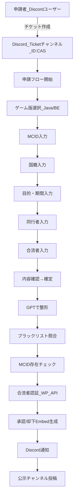
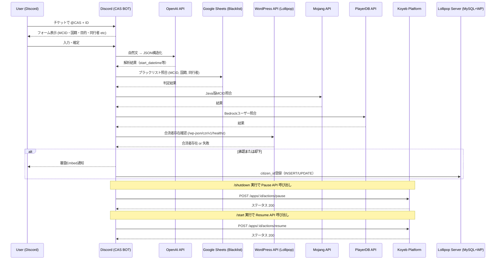

# Comzer-Administration-System
コムザール行政システム（Comzer Administration System）
**Discord 自動入国審査 BOT + ブラックリスト管理 + 役職発言 + 国民データ連携**

> このリポジトリは、レイヤー構成（`domain / application / infrastructure / presentation`）+ DI に
> リファクタリングされたバージョンです。機能・挙動は元のバージョンと同一です。

---

## 目次

- [概要](#概要)
- [審査フロー](#審査フロー)
- [システムフロー](#システムフロー)
- [ファイル構成](#ファイル構成)
- [主要依存パッケージ](#主要依存パッケージ)
- [セットアップ](#セットアップ)
- [Dockerでのセットアップ](#dockerでのセットアップ)
- [環境変数](#環境変数)
- [スラッシュコマンド一覧](#スラッシュコマンド一覧)
- [申請〜審査プロセス詳細](#申請審査プロセス詳細)
- [技術概要](#技術概要)
- [役職発言モード（rolepost）](#役職発言モードrolepost)
- [国民データ同期（czr-bridge）](#国民データ同期czr-bridge)
- [DM 通知 API](#dm-通知-api)
- [ログシステム](#ログシステム)
- [Googleスプレッドシート設定](#googleスプレッドシート設定)
- [よくあるトラブル](#よくあるトラブル)
- [ライセンス](#ライセンス)

---

## 概要

このリポジトリは、コムザール連邦共和国（Minecraft 仮想国家）の行政業務を **Discord 上で自動化** するための BOT を管理・開発するものです。

主な機能は以下の通りです。

- **自動入国審査**：申請内容を GPT-4o で構造化し、ブラックリスト・MCID 存在確認・入国期間チェックまで全自動処理
- **役職発言モード**：閣僚・外交官・審査官が Webhook を通じて役職名義で発言
- **ブラックリスト管理**：Google スプレッドシート連携で国・プレイヤーを管理
- **国民データ同期**：Discord メンバーの情報を WordPress API へ自動同期
- **DM 通知 API**：外部サービスからの審査結果通知を Discord DM で届ける REST API

---

## 審査フロー


```mermaid
graph TD
  User[申請者_Discordユーザー]
  Ticket[Discord_Ticketチャンネル_ID:CAS]
  StartFlow[申請フロー開始]
  Version[ゲーム版選択_Java/BE]
  Input1[MCID入力]
  Input2[国籍入力]
  Input3[目的・期間入力]
  Input4[同行者入力]
  Input5[合流者入力]
  Confirm[内容確認→確定]

  GPT[GPTで整形]
  CheckBL[ブラックリスト照合]
  CheckJoiner[合流者認証_WP_API]
  MojangAPI[MCID存在チェック]
  Result[承認/却下Embed生成]

  Notify[Discord通知]
  Publish[公示チャンネル投稿]

  User -->|チケット作成| Ticket
  Ticket --> StartFlow --> Version --> Input1 --> Input2 --> Input3 --> Input4 --> Input5 --> Confirm
  Confirm --> GPT --> CheckBL --> MojangAPI --> CheckJoiner --> Result
  Result --> Notify --> Publish
```

---

## システムフロー


```mermaid
sequenceDiagram
  participant User as User (Discord)
  participant Bot as Discord (CAS BOT)
  participant OpenAI as OpenAI API
  participant Sheet as Google Sheets (Blacklist)
  participant WP as WordPress API (Lollipop)
  participant Mojang as Mojang API
  participant PlayerDB as PlayerDB API
  participant Koyeb as Koyeb Platform
  participant Lollipop as Lollipop Server (MySQL+WP)

  User->>Bot: チケットで @CAS + ID
  Bot-->>User: フォーム表示 (MCID・国籍・目的・同行者 etc)
  User->>Bot: 入力・確定

  Bot->>OpenAI: 自然文 → JSON構造化
  OpenAI-->>Bot: 解析結果（start_datetime等）

  Bot->>Sheet: ブラックリスト照合 (MCID, 国籍, 同行者)
  Sheet-->>Bot: 判定結果

  Bot->>Mojang: Java版MCID照合
  Mojang-->>Bot: 結果
  Bot->>PlayerDB: Bedrockユーザー照合
  PlayerDB-->>Bot: 結果

  Bot->>WP: 合流者存在確認 (/wp-json/czr/v1/healthz)
  WP-->>Bot: 合流者存在 or 失敗

  alt 承認または却下
    Bot-->>User: 審査Embed通知
    Bot->>Lollipop: citizen_id登録（INSERT/UPDATE）
  end

  Note over Koyeb, Bot: /shutdown 実行で Pause API 呼び出し
  Bot->>Koyeb: POST /apps/:id/actions/pause
  Koyeb-->>Bot: ステータス 200

  Note over Koyeb, Bot: /start 実行で Resume API 呼び出し
  Bot->>Koyeb: POST /apps/:id/actions/resume
  Koyeb-->>Bot: ステータス 200
```

---

## ファイル構成

レイヤー最優先（`domain / application / infrastructure / presentation`）構成です。
各クラスはコンストラクタインジェクションで依存を受け取り、`src/index.ts` が唯一の組み立て場所（コンポジションルート）になっています。

```
.
├── src/
│   ├── index.ts                        # エントリーポイント兼コンポジションルート
│   │                                    # (Discordクライアント初期化・Expressサーバー起動・DI配線)
│   │
│   ├── domain/                         # 外部依存のない純粋ロジック
│   │   ├── model/
│   │   │   ├── Session.ts              # 審査セッションの型
│   │   │   └── ParsedApplication.ts    # GPT解析結果・審査結果の型
│   │   └── service/
│   │       ├── InspectionRules.ts      # 申請期間・必須項目の判定ルール
│   │       ├── RoleGroupClassifier.ts  # ロールID→グループ(diplomat/citizen)判定
│   │       ├── NotifyMessageComposer.ts# DM通知メッセージの組み立て
│   │       └── DiscordErrorMessages.ts # DM送信エラーコードの日本語分類
│   │
│   ├── application/                    # ユースケース層
│   │   ├── inspection/
│   │   │   └── InspectionOrchestrator.ts   # 審査コアロジック(旧 inspectionService.ts)
│   │   ├── session/
│   │   │   └── SessionLifecycleService.ts  # セッション管理・タイムアウト監視(旧 sessionManager.ts)
│   │   ├── blacklist/
│   │   │   └── BlacklistManagementService.ts # 追加/削除/一覧・権限チェック
│   │   ├── rolepost/
│   │   │   └── RolePostService.ts      # 役職発言モードの状態管理・Embed生成
│   │   ├── citizenSync/
│   │   │   └── MemberSyncService.ts    # WordPressへの同期処理(旧 syncMembers.ts)
│   │   ├── notification/
│   │   │   └── NotificationQueueService.ts # DM通知キュー・順次送信
│   │   └── ops/
│   │       ├── BotLifecycleService.ts  # shutdown/start(Koyeb連携)
│   │       ├── SelfCheckService.ts     # /status の自己診断
│   │       └── DebugModeState.ts       # デバッグモードのON/OFF状態
│   │
│   ├── infrastructure/                 # 外部システムクライアント
│   │   ├── openai/
│   │   │   ├── GptExtractionClient.ts  # OpenAI呼び出し
│   │   │   └── extractionPrompt.ts     # プロンプトテンプレート(旧 prompts.ts)
│   │   ├── minecraft/
│   │   │   ├── MojangClient.ts         # Java版MCID確認
│   │   │   └── PlayerDbClient.ts       # Bedrock版MCID確認
│   │   ├── sheets/
│   │   │   └── BlacklistRepository.ts  # Googleスプレッドシート CRUD(旧 blacklistManager.ts)
│   │   ├── czrBridge/
│   │   │   ├── CzrBridgeClient.ts      # 国民名簿API(HMAC署名、旧 czrApi.ts)
│   │   │   ├── JoinerMatchClient.ts    # 合流者照合API
│   │   │   └── CitizenInfoClient.ts    # /info コマンド用の国民情報取得API
│   │   ├── discord/
│   │   │   └── WebhookManager.ts       # 役職発言用Webhookの取得・キャッシュ
│   │   ├── koyeb/
│   │   │   └── KoyebClient.ts          # Pause/Resume API呼び出し
│   │   ├── logger/
│   │   │   ├── ConsoleHooks.ts         # console.log/errorのフック
│   │   │   ├── LogFilters.ts           # ログフィルタリング
│   │   │   ├── MessageLogWriter.ts     # メッセージ受信デバッグログ
│   │   │   ├── DiscordWebhookLogSink.ts# Discord Webhookへのログ送信
│   │   │   └── nowJST.ts               # JST時刻文字列ヘルパー
│   │   └── config/
│   │       ├── BotConfig.ts            # 環境変数の一元管理
│   │       ├── RoleConfig.ts           # 役職ロール設定(旧 roleConfig.ts)
│   │       ├── AppConfigLoader.ts      # config.json のロード
│   │       └── config.json             # チャンネルID・クライアントID等の静的設定
│   │
│   ├── presentation/
│   │   ├── discord/
│   │   │   ├── commands/               # 各スラッシュコマンド + CommandRegistry
│   │   │   │   ├── CommandRegistry.ts
│   │   │   │   ├── RolepostCommand.ts       # /rolepost
│   │   │   │   ├── DeleteRolepostCommand.ts # /delete_rolepost
│   │   │   │   ├── InfoCommand.ts           # /info
│   │   │   │   ├── StatusCommand.ts         # /status
│   │   │   │   ├── DebugCommand.ts          # /debug
│   │   │   │   ├── ShutdownCommand.ts       # /shutdown
│   │   │   │   ├── StartCommand.ts          # /start
│   │   │   │   ├── DeployCommand.ts         # /deploy
│   │   │   │   └── blacklist/
│   │   │   │       ├── AddCountryCommand.ts
│   │   │   │       ├── RemoveCountryCommand.ts
│   │   │   │       ├── AddPlayerCommand.ts
│   │   │   │       ├── RemovePlayerCommand.ts
│   │   │   │       ├── ListBlacklistCommand.ts
│   │   │   │       └── shared.ts            # 権限チェック共通処理
│   │   │   ├── events/
│   │   │   │   └── EventRegistrar.ts        # イベント登録(旧 eventhandlers.ts)
│   │   │   └── interactions/
│   │   │       ├── InteractionRouter.ts     # ボタン/モーダル/セレクト/コマンドの分岐
│   │   │       ├── ButtonInteractionHandler.ts
│   │   │       ├── SelectMenuHandler.ts
│   │   │       ├── ModalSubmitHandler.ts
│   │   │       ├── JoinerResponseHandler.ts
│   │   │       ├── MessageTriggerHandler.ts # 審査セッション開始トリガー(旧 messageHandler.ts)
│   │   │       └── ApplicationEmbeds.ts     # 承認/却下/公示Embed生成
│   │   └── http/
│   │       └── NotifyApiRoute.ts       # POST /api/notify
│   │
│   └── scripts/
│       ├── deploy-commands.ts          # コマンド一括登録スクリプト
│       └── test-upsert.ts              # czr-bridgeのupsert動作確認スクリプト
│
├── Dockerfile                          # マルチステージビルド(builder→runtime)
├── docker-compose.yml                  # bot / deploy-commands の2サービス
├── .dockerignore
├── .env.example
├── package.json
└── tsconfig.json
```

## 主要依存パッケージ

### dependencies（本番実行時に必要）

| パッケージ | 用途 |
|---|---|
| `discord.js` v14 | Discord API クライアント・スラッシュコマンド・Webhook 管理 |
| `openai` | GPT-4o による申請内容の自然言語解析・JSON 変換 |
| `axios` | Mojang API / PlayerDB API / Koyeb API / WordPress API への HTTP リクエスト |
| `google-spreadsheet` | Google スプレッドシートのブラックリスト読み書き |
| `google-auth-library` | Google サービスアカウント認証（JWT） |
| `express` v5 | `/api/notify` 等の REST API エンドポイント提供 |
| `body-parser` | POST リクエストの JSON パース |
| `node-fetch` | czr-bridge API へのリクエスト（ESM 環境） |

### devDependencies（ビルド時のみ必要）

| パッケージ | 用途 |
|---|---|
| `typescript` | `.ts` → `.js` へのコンパイル（`tsc`） |
| `@types/node` | Node.js組み込みAPI（`process`, `Buffer`, `https`等）の型定義 |
| `@types/express` | Express の `Request` / `Response` 等の型定義 |

バージョン詳細は `package.json` を参照してください。

## セットアップ

### 1. リポジトリのクローン

```bash
git clone <repository-url>
cd <repository>
```

### 2. 依存関係のインストール

```bash
npm install
```

### 3. 環境変数の設定

`.env.example` を参考に `.env` を作成し、各種キーを設定してください。

```bash
cp .env.example .env
# エディタで .env を編集
```

### 4. ビルド

```bash
npx tsc
```

`npm run build` を使うと `postbuild` フックで `npm run deploy`（スラッシュコマンドの Discord への一括登録）が
自動的に続けて実行されます。コンパイルのみ行いたい場合は `npx tsc` を直接使ってください。

コマンド登録だけを単独で行いたい場合：

```bash
npm run deploy
```

グローバルコマンドとして Discord に登録されます。反映まで最大 1 時間かかる場合があります。

### 5. BOT の起動

```bash
npm start
# または
node dist/index.js
```

> **Note:** Node.js 20 以上が必要です。

---

## Dockerでのセットアップ

```bash
cp .env.example .env
docker compose build
docker compose up -d bot
```

コマンド登録（deploy-commands）は、通常運用のコンテナ起動では自動実行されません。
コマンド定義を追加・変更した時だけ、以下を手動実行してください。

```bash
docker compose run --rm deploy-commands
```

> `Dockerfile` のビルドステージは `npm run build` ではなく `npx tsc` を直接呼んでいます。
> `postbuild`（Discordへのコマンド登録）はシークレットとDiscordへのネットワーク到達性を
> ビルド時に要求してしまうため、イメージビルドからは意図的に切り離しています。

---

## 環境変数

| 変数名 | 説明 | 必須 |
|---|---|---|
| `DISCORD_TOKEN` | Discord Bot トークン | ✅ |
| `DISCORD_WEBHOOK_URL` | コンソールログの転送先 Discord Webhook URL | |
| `OPENAI_API_KEY` | OpenAI API キー（GPT-4o 使用） | ✅ |
| `CASBOT_API_SECRET` | `/api/notify` エンドポイントおよび WordPress API の認証キー | ✅ |
| `YOUR_SECRET_API_KEY` | 合流者確認 API（czr データアクセス）の認証キー | ✅ |
| `ROLLID_MINISTER` | 閣僚会議議員のロール ID（カンマ区切り複数可） | ✅ |
| `ROLLID_DIPLOMAT` | 外交官のロール ID（カンマ区切り複数可） | ✅ |
| `EXAMINER_ROLE_IDS` | 入国審査担当官のロール ID（カンマ区切り複数可） | ✅ |
| `STOP_ROLE_IDS` | `/shutdown` `/start` コマンドを実行できるロール ID | |
| `STOP_USER_IDS` | `/start` コマンドを実行できるユーザー ID | |
| `DEPLOY_ROLE_ID` | `/deploy` コマンドを実行できるロール ID | |
| `GOOGLE_SHEET_ID` | ブラックリスト管理用スプレッドシートの ID | ✅ |
| `GOOGLE_SERVICE_ACCOUNT_EMAIL` | Google サービスアカウントのメールアドレス | ✅ |
| `GOOGLE_PRIVATE_KEY` | Google サービスアカウントの秘密鍵（`\n` エスケープ） | ✅ |
| `BLACKLIST_TAB_NAME` | スプレッドシートのシート名（デフォルト: `blacklist(CAS連携)`） | |
| `CZR_BASE` | czr-bridge WordPress プラグインの API ベース URL | ✅ |
| `CZR_KEY` | czr-bridge API キー（デフォルト: `casbot`） | |
| `CZR_SECRET` | czr-bridge HMAC-SHA256 署名シークレット | ✅ |
| `CZR_GUILD_ID` | `scripts/test-upsert.ts` 実行時のみ参照される動作確認用サーバーID（本体の同期処理では固定値を使用） | |
| `CZR_THROTTLE_MS` | 同期時のスロットル間隔（ms、デフォルト: `700`） | |
| `CZR_SYNC_INTERVAL_MS` | 定期同期の実行間隔（ms、デフォルト: `10800000` = 3時間） | |
| `TICKET_CAT` | 入国審査チケットのカテゴリチャンネル ID | ✅ |
| `LOG_CHANNEL_ID` | 審査ログファイル送信先チャンネル ID | ✅ |
| `ADMIN_KEYWORD` | 管理レポートを出力するトリガーキーワード（デフォルト: `!status`） | |
| `KOYEB_API_TOKEN` | Koyeb API トークン（shutdown/start 使用時） | |
| `KOYEB_APP_ID` | Koyeb アプリ ID（shutdown/start 使用時） | |
| `PORT` | Express サーバーのポート番号（デフォルト: `3000`） | |

---

## スラッシュコマンド一覧

### 入国審査・情報系

| コマンド | 説明 |
|---|---|
| `/info` | 自分の国民登録情報を表示 |

### 役職発言系

| コマンド | 説明 |
|---|---|
| `/rolepost` | 役職発言モードの ON/OFF を切替（複数ロール所持時は選択メニュー表示） |
| `/delete_rolepost` | 指定メッセージ ID の役職発言（Bot 送信の Webhook メッセージ）を削除 |

### ブラックリスト管理系

| コマンド | 説明 |
|---|---|
| `/add_country <name>` | 指定した国名をブラックリストに追加（既に無効の場合は再有効化）|
| `/remove_country <name>` | 指定した国名をブラックリストから削除（論理削除）|
| `/add_player <mcid>` | 指定した MCID をブラックリストに追加|
| `/remove_player <mcid>` | 指定した MCID をブラックリストから削除（論理削除）|
| `/list_blacklist` | 現在有効なブラックリストを Embed で一覧表示（ephemeral） |

### 管理・運用系

| コマンド | 説明 |
|---|---|
| `/status` | Bot の接続状態・各 API との連携状況を自己診断して表示 |
| `/debug <ON\|OFF>` | デバッグモードを切替（ON 時は公示をデバッグチャンネルへ転送） |
| `/shutdown` | Bot を停止（Koyeb の Pause API を呼び出し）|
| `/start` | Bot を再起動（Koyeb の Resume API を呼び出し）|
| `/deploy` | スラッシュコマンドを Discord に再登録|

---

## 申請〜審査プロセス詳細

### トリガー条件

Ticket ツールが作成したカテゴリチャンネル（`TICKET_CAT`）内のメッセージで、以下の条件をすべて満たすと審査セッションが開始されます。

- Bot がメンションされている
- メッセージ本文に `ID:CAS` が含まれている

### セッションの流れ

```
[セッション開始]
    ↓
① 留意事項の表示（進む / 終了 ボタン）
    ↓
② ゲームエディション選択（Java Edition / Bedrock Edition）
    ↓
③ 申請フォーム（Modal）入力
    │  ・MCID / ゲームタグ
    │  ・国籍
    │  ・入国期間と目的
    │  ・同行者（任意、カンマ区切り）
    │  ・合流者（任意、カンマ区切り）
    ↓
④ AI 解析（GPT-4o で JSON 化）
    ↓
⑤ 審査処理（順次実行）
    ├── 国籍ブラックリストチェック
    ├── 申請者 MCID ブラックリストチェック
    ├── Mojang / PlayerDB API で MCID 存在確認
    ├── 同行者全員のブラックリスト・MCID 存在確認
    └── 合流者の WordPress API 照合 + Discord ID 特定
    ↓
⑥ 合流者がいる場合 → DM 送信で確認（全員の回答後に継続）
    ↓
⑦ 承認 Embed または却下 Embed を返信
    ↓
[承認時] 公示チャンネルへ入国情報を投稿
[終了]   セッションログを LOG_CHANNEL にファイル送信
```

### タイムアウト処理

- 申請フォームの操作が **10 分間** 行われない場合、セッションは自動タイムアウト
- `waitingJoiner`(合流者確認待ち)状態のセッションはタイムアウト対象外
- 審査処理自体が **60 秒** 以上かかった場合もタイムアウトとして中断

---

## 技術概要

### GPT-4o による申請内容の構造化

`src/infrastructure/openai/extractionPrompt.ts` に定義されたプロンプトを使用し、
ユーザーが自由記述で入力した内容を以下の JSON 形式に変換します。

```json
{
  "mcid": "taro_des",
  "nation": "テスト=デス王国",
  "purpose": "観光",
  "start_datetime": "2025-06-26 15:00",
  "end_datetime": "2025-06-26 22:00",
  "companions": [{ "mcid": "tanaka_kei" }],
  "joiners": ["kouji_JP"]
}
```

- `__TODAY__` プレースホルダーを実行時の日付に置換して渡します
- 24 時間を超える申請の終了日時は未記載の場合 `23:59` で補完
- `response_format: json_object` を使用してレスポンスの確実な JSON 出力を保証

### ブラックリスト照合

Google スプレッドシートの `blacklist(CAS連携)` シートを参照します。起動時に `BlacklistRepository.init()`
で初期化し、以降はインメモリのシートオブジェクトを再利用します。

- 申請者の国籍・MCID に加え、**同行者全員** についても順次チェック
- `status` が `Active` の行のみ有効
- 削除は物理削除ではなく `status` を `invalid` に変更する論理削除方式

### MCID 存在確認

| エディション | 使用 API |
|---|---|
| Java Edition | `https://api.mojang.com/users/profiles/minecraft/:mcid` |
| Bedrock Edition | `https://playerdb.co/api/player/xbox/:mcid` |

`BE_` プレフィックスが付いている MCID は自動的に Bedrock として判定します。

---

## 役職発言モード（rolepost）

`/rolepost` を実行すると、そのチャンネルで役職発言モードが有効になります（トグル式）。

有効中にメッセージを送ると：

1. 元メッセージを自動削除
2. 役職名・アイコンが設定された Webhook からメッセージを再送信（Embed 形式）
3. 画像添付にも対応（Embed の image フィールドへ）

複数の役職ロールを持つ場合はセレクトメニューで発言モードを選択できます。役職設定は
`src/infrastructure/config/RoleConfig.ts` で管理されており、環境変数のロール ID に基づいて動的に生成されます。

| 役職 | 環境変数 | Webhook 名称 |
|---|---|---|
| 閣僚会議議員 | `ROLLID_MINISTER` | コムザール連邦共和国 大統領府 |
| 外交官（外務省 総合外務部職員） | `ROLLID_DIPLOMAT` | コムザール連邦共和国 外務省 |
| 入国審査担当官 | `EXAMINER_ROLE_IDS` | コムザール連邦共和国 大統領府 |

---

## 国民データ同期（czr-bridge）

Discord サーバーのメンバー情報を定期的に WordPress の czr-bridge API へ同期します。

- **起動時**：全メンバーを一括同期（`MemberSyncService.fullSync`）
- **定期実行**：`CZR_SYNC_INTERVAL_MS`（デフォルト 3 時間）ごとに全件同期
- **リアルタイム**：メンバーの参加・ロール変更時に即時同期（`MemberSyncService.syncMember`）

ロールによるグループ分類：

| グループ | 条件 |
|---|---|
| `diplomat` | `ROLLID_DIPLOMAT` に含まれるロールを所持 |
| `citizen` | それ以外 |

API 通信は HMAC-SHA256 署名付きで行われ、レート制限に対して指数バックオフ付きリトライ（最大 5 回）を実装しています。

---

## DM 通知 API

外部サービス（WordPress 等）から Discord ユーザーへ DM を送信するための REST API です。

### エンドポイント

```
POST /api/notify
```

### 認証

```
X-API-Key: <CASBOT_API_SECRET>
```

### リクエスト例

```json
{"discord_id":"1116002234208104479",
"request_id":"1000",
"request_name":"staff_appointment",
"request_content":"略",
"created_at":"2026-03-05 16:32:23",
"department":"大統領府事務局",
"decision_event":"承認",
"decision_datetime":"2026-03-05 16:32:38",
"notice":""
}
```

### 対応している `request_name`

| キー | 表示名 |
|---|---|
| `registry_update` | 国民登記情報修正申請 |
| `business_filing` | 開業・廃業届 |
| `staff_appointment` | 職員登用申請 |
| `donation_report` | 寄付申告 |
| `party_membership` | 入党・離党届 |
| `party_create_dissolve` | 結党・解党届 |
| `citizen_recommend` | 新規国民推薦届 |
| `citizen_denunciation` | 脱退申告 |
| `anonymous_report` | 匿名通報 |

送信はキューで管理され、1.5 秒間隔で順次処理されます。送信失敗時のエラーコードもログに記録されます。

| エラーコード | 意味 |
|---|---|
| `50007` | ユーザーが DM を閉じているか Bot をブロックしている |
| `10013` | ユーザー ID が不正または存在しない |
| `50001` | Bot にメッセージ送信権限がない |

---

## ログシステム

`console.log` / `console.error` をフックし、ログを Discord Webhook へ転送します。

- `DISCORD_WEBHOOK_URL` が設定されている場合のみ有効
- `src/infrastructure/logger/LogFilters.ts` でチャンネル ID やメッセージ内容などの機密情報を含むログを除外
- 入国審査セッションの全ログはセッション終了時にテキストファイルとして `LOG_CHANNEL_ID` に送信

---

## Googleスプレッドシート設定

ブラックリスト管理に使用するスプレッドシートのシート（タブ）には以下のカラムが必要です。

| カラム名 | 説明 |
|---|---|
| `Type(Country/Player)` | `Country` または `Player` |
| `status` | `Active`（有効）または `invalid`（無効） |
| `value` | 国名または MCID |
| `reason` | 登録理由 |
| `date` | 登録・更新日（YYYY-MM-DD） |

> ⚠️ 物理削除は行いません。削除時は `status` を `invalid` に変更します。

---

## よくあるトラブル

### 日付変換がうまくいかない

`src/infrastructure/openai/extractionPrompt.ts` 内の `__TODAY__` プレースホルダーが正しく置換されているか確認してください。
`InspectionOrchestrator`（`src/application/inspection/InspectionOrchestrator.ts` 経由の `GptExtractionClient`）内で
`extractionPrompt.replace("__TODAY__", today)` が呼ばれています。

### セッションが途中で止まる（硬直）

- `InspectionOrchestrator.runInspection` 内の `await` がタイムアウトしていないか確認
- OpenAI API キーの利用上限に達していないか確認
- Mojang / PlayerDB API が一時的に応答していない場合があります（外部依存）

### ブラックリストが反映されない

以下を確認してください。

- `BLACKLIST_TAB_NAME` がスプレッドシートのシート名と完全一致しているか
- カラム名（`Type(Country/Player)` など）が正確に設定されているか
- `status` が `Active`（大文字小文字に注意）になっているか
- Google サービスアカウントにスプレッドシートの編集権限が付与されているか

### 役職発言モードで Webhook が作成されない

Bot にそのチャンネルへの「Webhook の管理」権限が付与されているか確認してください。

### `/status` で「連携失敗」が表示される

各 API の疎通状況を確認してください。

- 国民名簿：`https://comzer-gov.net/wp-json/czr/v1/healthz` へのアクセス
- ブラックリスト：Google サービスアカウントの認証情報と権限
- Mojang API：外部ネットワーク疎通
- Bedrock API：`playerdb.co` への疎通

---

## ライセンス

COMZER License — 詳細は [LICENSE](./LICENSE) ファイルを参照してください。